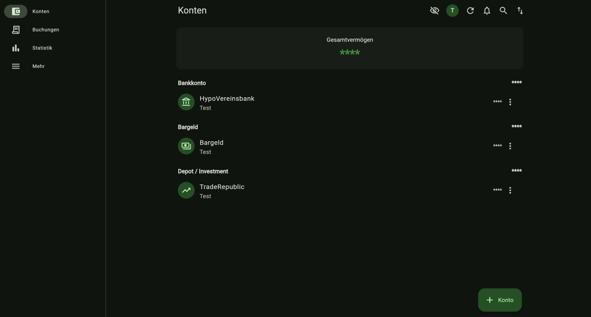
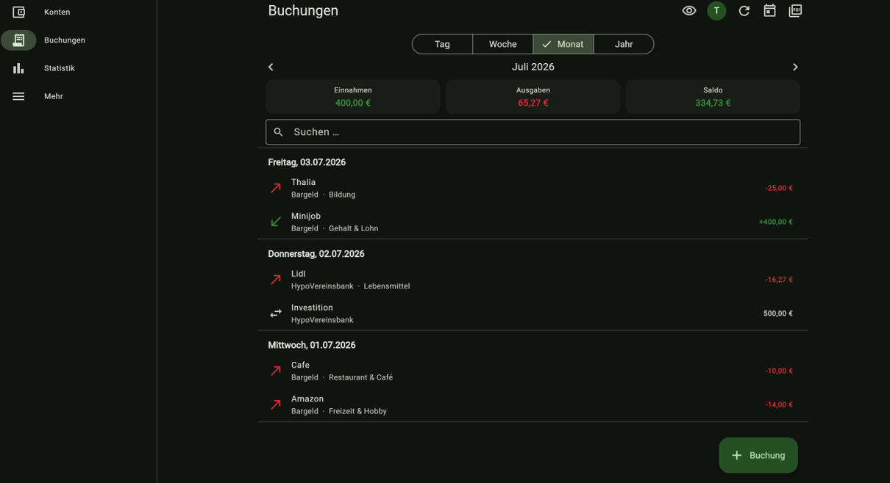
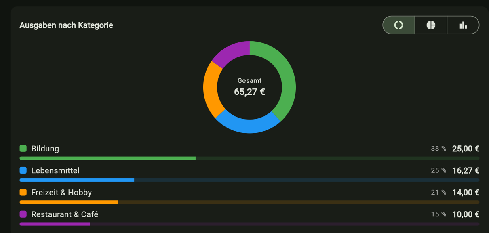
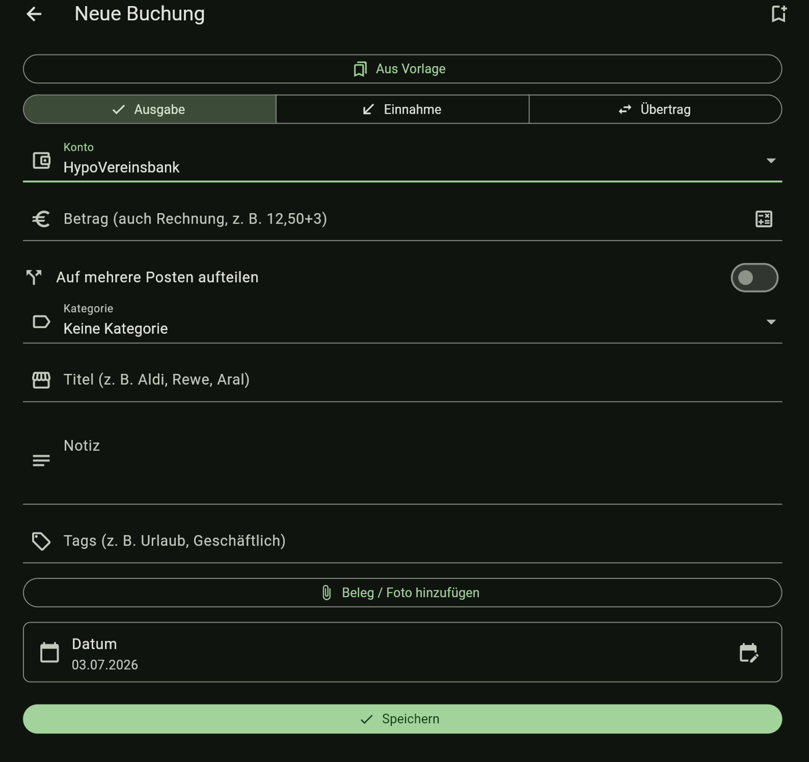
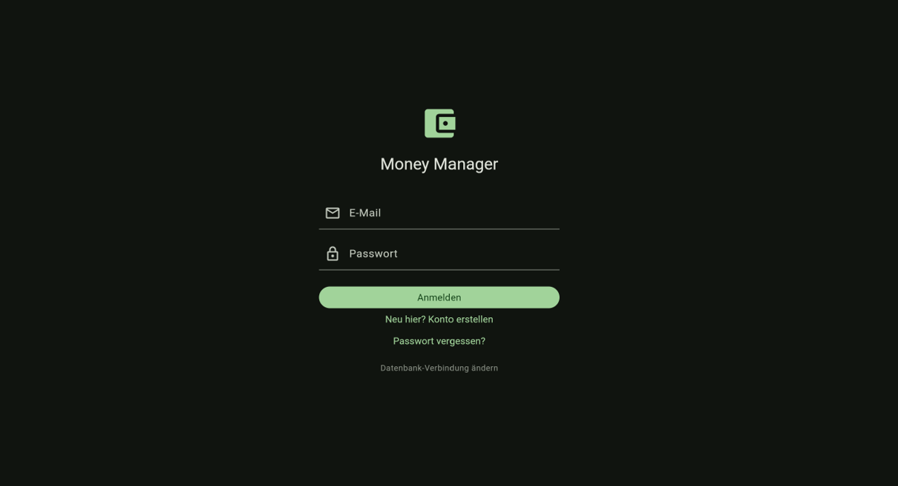
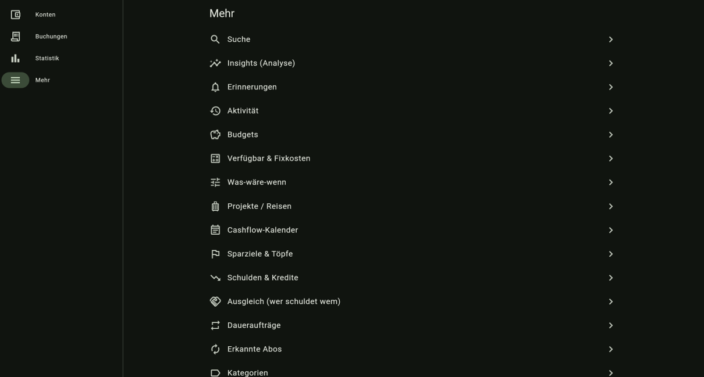

# Money-Manager

🇩🇪 **Deutsch** · [🇬🇧 English](README.en.md)

Gemeinsame **Finanz-Buchhaltung für eine kleine, vertraute Gruppe** – eine
Flutter-Codebasis für **Windows**, **Android** und **Web (PWA)**, zweisprachig
**Deutsch/Englisch**. Jede Person führt ihre Konten selbst; geteilt wird
gezielt über Freigaben und Gemeinschaftskonten. Alle Geräte werden über
**Supabase** live synchronisiert.

## Tech-Stack

| Bereich        | Wahl                                                     |
|----------------|----------------------------------------------------------|
| UI / Client    | **Flutter** (Windows + Android + Web, eine Codebasis)    |
| Backend        | **Supabase** (Postgres, Auth, Realtime, Storage, Edge Functions) |
| Berechtigungen | **Row Level Security** in der Datenbank                  |
| State-Mgmt     | **Riverpod**                                             |
| Navigation     | **go_router**                                            |

Warum dieser Stack? → [`docs/ARCHITECTURE.md`](docs/ARCHITECTURE.md)

## Screenshots

| Konten | Buchungen | Statistik |
|---|---|---|
|  |  |  |

| Neue Buchung | Onboarding | Desktop (Windows) |
|---|---|---|
|  |  |  |

## 🚀 Eigene Instanz (ohne Programmierkenntnisse)

Du möchtest die App mit **deiner eigenen, kostenlosen Datenbank** nutzen – am
Handy, Tablet, Laptop oder Monitor – ohne etwas zu programmieren oder zu bauen?
So geht's in wenigen Minuten:

1. **Repo forken.** Oben rechts auf **„Fork"** klicken → das Projekt liegt jetzt
   in deinem GitHub-Konto.
2. **Nichts weiter nötig zum „Abkoppeln".** Die mitgelieferte
   `assets/db_connection/connection.json` ist nur ein **Platzhalter** — ein
   frischer Fork verbindet sich damit **nicht** mit einer fremden Datenbank,
   sondern startet **leer** im Onboarding. Du musst die Datei also **nicht**
   löschen. Deine **eigene** Datenbank bindest du in Schritt 5 (Secrets,
   empfohlen) oder direkt im Onboarding (Schritt 6). *(Fortgeschritten: Statt
   Secrets kannst du die Platzhalter-Werte auch durch die Zugangsdaten deines
   eigenen Projekts ersetzen — dann verbindet sich deine Seite fest damit.)*
3. **Kostenloses Supabase-Projekt anlegen.** Auf [supabase.com](https://supabase.com)
   registrieren → **New Project** (Region Europa empfohlen) → kurz warten, bis es
   fertig ist.
4. **Datenbank einrichten (1 Klick).** Im Supabase-Dashboard **„SQL Editor"**
   öffnen, den kompletten Inhalt von [`supabase/setup.sql`](supabase/setup.sql)
   einfügen und **„Run"** klicken. (Diesen SQL-Text bietet die App beim ersten
   Start auch per Kopier-Knopf an.)
   - Optional, damit die Registrierung ohne E-Mail-Bestätigung klappt:
     **Authentication → Providers → Email → „Confirm email" ausschalten.**
5. **Website veröffentlichen (GitHub Pages).** In deinem Fork:
   **Settings → Pages → Source: „GitHub Actions".** Dann unter **Actions** den
   Workflow **„Deploy Web (GitHub Pages)"** einmal starten (oder einen kleinen
   Commit machen). Nach ~2 Minuten ist die Seite unter
   `https://<dein-name>.github.io/<repo-name>/` erreichbar.
   - **Optional (Auto-Verbindung deiner Seite):** Hinterlege in **Settings →
     Secrets and variables → Actions** die zwei Secrets `SUPABASE_URL` und
     `SUPABASE_ANON_KEY` (deines **eigenen** Projekts aus Schritt 3). Dann
     verbindet sich *deine* veröffentlichte Seite automatisch mit deiner
     Datenbank. Ohne Secrets startet die Seite leer und fragt im Onboarding
     nach den Zugangsdaten (siehe Schritt 6).
6. **App öffnen & verbinden.** Ein frischer Fork (mit Platzhalter-
   `connection.json`, siehe Schritt 2) startet **leer** und zeigt das
   Onboarding mit zwei Wegen:
   **„Neue Installation"** (eigene, leere DB) oder **„Mit bestehender DB
   verbinden"**. Trage **Supabase-URL** und **anon/publishable Key** ein
   (beide im Supabase-Dashboard unter *Project Settings → Data API* bzw.
   *API Keys*) → **„Verbinden & starten"**.
   - **Die erste Person, die sich registriert, wird automatisch Besitzer**
     (Administrator mit allen Rechten – geschützt, nicht entziehbar).
   - Verbindung später ändern/trennen: **Mehr → Einstellungen →
     Datenbank-Verbindung** (gilt nur für dieses Gerät, Daten bleiben erhalten).

> **Enthält deine `connection.json` echte, fremde Zugangsdaten?** (Nur bei
> sehr alten Forks oder wenn von Hand eingetragen — die mitgelieferte Datei
> ist heute ein Platzhalter.) Dann verbindet sich deine Seite mit dieser
> fremden Datenbank. Anzeichen: im Supabase-Dashboard des betroffenen Projekts
> (Authentication → Users) tauchen unerwartete Konten auf. Fix: die Datei auf
> den Platzhalter zurücksetzen (oder mit den Zugangsdaten deines **eigenen**
> Projekts überschreiben), neu deployen, und die versehentlich angelegten
> Konten dort wieder entfernen.

> **Auf dem iPhone:** Seite in **Safari** öffnen → **Teilen** → **„Zum
> Home-Bildschirm"**. Dann startet Money Manager wie eine echte App (PWA).
> Auf Android funktioniert das in Chrome genauso („App installieren").

### 🔄 Updates automatisch erhalten

Dein Fork bekommt Bugfixes und neue Features aus diesem Original-Repo **automatisch**
— **einmal pro Woche** (montags) synchronisiert ein mitgelieferter Workflow
(„Sync Fork with Upstream") deinen Fork mit dem Original. Deine eigene
Datenbank-Verbindung (`assets/db_connection/connection.json`) bleibt dabei
**garantiert unangetastet**. Nach einem sauberen Sync deployt sich deine Seite
automatisch neu (via „Deploy Web").

- **Sofort aktualisieren, statt eine Woche zu warten:** In deinem Fork unter
  **Actions → „Sync Fork with Upstream" → Run workflow**.
- **Falls du selbst Code im Fork verändert hast** und es dadurch zu einem
  echten Konflikt kommt (nicht bei `connection.json` — die ist geschützt):
  Der Workflow merged dann nicht still, sondern öffnet eine **Pull Request**
  zum manuellen Prüfen unter **Pull requests**.
- Braucht keine Einrichtung — der Workflow ist Teil dieses Repos und kommt mit
  jedem neuen Fork automatisch mit.

> **Alternative zum Hosting:** Statt GitHub Pages kannst du den Ordner
> `build/web` (nach `flutter build web`) auch bei **Cloudflare Pages** oder
> **Netlify** hochladen – beides kostenlos und ohne eigenes Konto bei dritten
> nötig. GitHub Pages ist hier vorkonfiguriert und am einfachsten.

Die Zugangsdaten landen **nur lokal im Gerät** (bzw. Browser) – nicht im Code
und nicht auf GitHub. Jede Person/Instanz nutzt so ihre **eigene, getrennte
Datenbank**.

---

## 🗄️ Alte Jahre archivieren (optional – Speicher freigeben)

Wird der kostenlose Supabase-Speicher knapp (v. a. durch Beleg-Fotos), kannst du
**alte Jahre verschlüsselt in ein privates GitHub-Repo auslagern**. Sie bleiben
in der App **einsehbar, aber schreibgeschützt** und zählen nicht mehr zu
Statistik/Budgets. Jede Instanz richtet ihr **eigenes** Archiv-Repo ein.

> ⚠️ Nur nutzen, wenn der Speicher fast voll ist. Archivierte Jahre lassen sich
> erst nach dem Zurückholen wieder bearbeiten.

**So richtest du es ein:**

1. **Privates Archiv-Repo anlegen.** Auf GitHub ein **neues, privates** Repo
   erstellen (z. B. `money-manager-archive`) – **leer, ohne Code**, es nimmt nur
   die Archivdateien (`archive/<jahr>.json.enc`) auf. Privat ist wichtig: dort
   liegen deine Finanzdaten (zusätzlich verschlüsselt).
2. **Zugriffs-Token erzeugen.** GitHub → **Settings → Developer settings →
   Personal access tokens → Fine-grained tokens → Generate new token**:
   - **Repository access:** „Only select repositories" → dein Archiv-Repo.
   - **Permissions → Repository permissions → Contents: Read and write.**
   - Token erzeugen und **kopieren** (wird nur einmal angezeigt).
3. **Datenbank-Funktionen einspielen.** Bei einer **neuen** Instanz ist alles
   schon in [`supabase/setup.sql`](supabase/setup.sql) enthalten. Bei einer
   **bestehenden** Instanz im Supabase **SQL Editor** zusätzlich
   [`supabase/migrations/0024_archived_years.sql`](supabase/migrations/0024_archived_years.sql)
   und [`supabase/migrations/0025_archive_config.sql`](supabase/migrations/0025_archive_config.sql)
   ausführen.
4. **Edge Function bereitstellen.** Die Funktion
   [`supabase/functions/archive-proxy`](supabase/functions/archive-proxy) hält
   Token & Schlüssel serverseitig (nie im Client). Bereitstellen per CLI
   `supabase functions deploy archive-proxy` **oder** im Supabase-Dashboard unter
   **Edge Functions → Deploy a new function** (Code aus `index.ts` einfügen).
   Es sind **keine** Function-Secrets nötig – Repo/Token/Schlüssel kommen aus
   der App (Schritt 5).
5. **In der App verbinden.** **Mehr → Archivierte Jahre** (oder
   **Verwaltung → Alte Jahre archivieren**) → **„Archiv-Repo verbinden"**:
   Repo (`owner/name` oder URL) und Token eintragen → **Verbinden**. Die App
   erzeugt einen **Verschlüsselungs-Schlüssel** und zeigt ihn **einmalig** an –
   **sichere eine Kopie** (ohne ihn sind Archive bei DB-Verlust nicht
   wiederherstellbar). Token & Schlüssel liegen danach serverseitig in Supabase.
6. **Archivieren.** Jahre ankreuzen → Warnung bestätigen → fertig. Über
   **„Ansehen"** liest du ein Jahr read-only; **„Zurückholen"** (Admin) holt es
   wieder in die DB.

---

## Voraussetzungen (einmalig einrichten)

1. **Flutter SDK** – in diesem Projekt nach `C:\dev\flutter` installiert.
   Damit `flutter` überall funktioniert, `C:\dev\flutter\bin` zur **PATH**-Umgebungs­variable
   hinzufügen (Windows-Suche → „Umgebungsvariablen bearbeiten").
2. **Für Android-Builds:** Android Studio (bringt Android SDK + Emulator mit).
   Danach einmalig `flutter doctor --android-licenses` ausführen.
3. **Für Windows-Desktop-Builds:**
   - **Visual Studio** (Community reicht) mit der Workload
     *„Desktopentwicklung mit C++"*.
   - **Windows-Entwicklermodus aktivieren** (für Plugin-Symlinks):
     Einstellungen → *für Entwickler* → **Entwicklermodus: Ein**
     (oder `start ms-settings:developers`).
4. Status prüfen mit:
   ```powershell
   flutter doctor
   ```

## Einrichtung

### 1. Supabase-Backend
Folge [`supabase/README.md`](supabase/README.md): Projekt anlegen, Schema aus
[`supabase/setup.sql`](supabase/setup.sql) einspielen (ein Skript, idempotent),
**Project URL** + **anon/publishable Key** kopieren.

### 2. Zugangsdaten lokal hinterlegen
```powershell
Copy-Item env.example.json env.json
```
Dann `env.json` öffnen und deine Werte eintragen:
```json
{
  "SUPABASE_URL": "https://dein-projekt.supabase.co",
  "SUPABASE_ANON_KEY": "dein-anon-publishable-key"
}
```
`env.json` ist in `.gitignore` und wird **nicht** eingecheckt.

### 3. Abhängigkeiten holen
```powershell
flutter pub get
```

## Starten

```powershell
# Windows-Desktop
flutter run -d windows --dart-define-from-file=env.json
#   oder per Skript:
.\tool\run-windows.ps1

# Android (Gerät/Emulator muss in `flutter devices` auftauchen)
flutter run -d android --dart-define-from-file=env.json
#   oder per Skript:
.\tool\run-android.ps1
```

> Hinweis: `env.json` ist für die **eigene Entwickler-Instanz** der bequemste
> Weg (Zugangsdaten fest vorgegeben). Lässt man es weg, zeigt die App beim
> ersten Start das **Onboarding** und fragt URL + Key dort ab (siehe
> [Eigene Instanz](#-eigene-instanz-ohne-programmierkenntnisse)).
> Auflösungs-Reihenfolge der Verbindung (höchste zuerst): **1.** pro Gerät
> gespeicherte Verbindung („Datenbank-Verbindung ändern"/Onboarding) →
> **2.** committete `assets/db_connection/connection.json` → **3.** `env.json`
> bzw. GitHub-Secrets.

## Projektstruktur

```
Money-Manager/
├── lib/
│   ├── main.dart                 # Bootstrap: Konfig prüfen, Supabase-Init, App-Start
│   ├── app.dart                  # MaterialApp.router (Theme, Sprache, App-Sperre)
│   ├── config/                   # Verbindungs-Auflösung (Geräte-Override, connection.json, dart-define)
│   ├── core/                     # Router + Bottom-Navigation + Theme
│   ├── data/
│   │   ├── models/               # Account, AppTransaction, Budget, Category, …
│   │   ├── repositories/         # Supabase-Zugriff (eine Repo-Klasse pro Domäne)
│   │   └── local/                # Offline-Cache (Local-First)
│   ├── features/                 # je Feature: Screen + Riverpod-Provider
│   │   └── accounts / transactions / statistics / budgets / savings /
│   │       recurring / planning / debts / projects / settle / insights /
│   │       reminders / archive / export / backup / admin / settings / …
│   ├── shared/                   # wiederverwendbare Widgets/Helfer
│   └── l10n/                     # Übersetzungstabelle DE/EN (hand-gepflegt)
├── supabase/
│   ├── setup.sql                 # Komplett-Setup (idempotent) für neue Instanzen
│   ├── migrations/               # Schema-Historie 0001…
│   ├── functions/                # Edge Functions (Admin-Wartung, Archiv-Proxy)
│   └── README.md                 # Backend-Einrichtung
├── docs/ARCHITECTURE.md
├── tool/                         # run-/Build-Skripte (Windows/Android/MSIX)
├── env.example.json              # Vorlage für env.json
└── ...                           # android/ · windows/ · web/ (von Flutter generiert)
```

## Berechtigungsmodell

Gemacht für eine **kleine, vertrauenswürdige Gruppe** – aber mit klaren Grenzen
(per RLS in der Datenbank durchgesetzt):

- **Zugang** nur für per **E-Mail-Whitelist** freigeschaltete Personen; die
  erste registrierte Person wird **Besitzer** (Admin, nicht entziehbar).
- **Konten und ihre Buchungen** sieht und bearbeitet nur, wer sie besitzt –
  oder wem sie per **Freigabe/Gemeinschaftskonto** geteilt wurden.
- **Kategorien, Budgets, Sparziele, Vorlagen, Regeln und Währungskurse** sind
  ebenfalls **pro Besitzer** getrennt (sichtbar/änderbar nur für Besitzer +
  Freigaben). **Preset-Kategorien** bleiben für alle lesbar (gemeinsame
  Standard-Kategorien); ändern darf sie nur ein Admin.
- Belege liegen **pro Eigentümer** im Storage.
- **Zerstörerische Wartungs-RPCs** (DB leeren, Werkszustand, Aufräumen) sind
  nur über den Server (Edge Functions mit Admin-Prüfung) erreichbar, nicht mit
  dem öffentlichen Client-Schlüssel.

Strenger/lockerer machen = RLS-Policies in [`supabase/setup.sql`](supabase/setup.sql)
anpassen, die App bleibt gleich.

## Datensicherheit & Verschlüsselung

Kurz: **Ja, die Daten sind geschützt** – nicht durch Geheimhaltung des im
Web-Build sichtbaren Schlüssels, sondern durch **serverseitige Zugriffsregeln**.

- **Übertragung:** Alle Verbindungen laufen über **HTTPS/TLS** (verschlüsselt
  unterwegs).
- **Speicherung:** Supabase (Postgres + Storage) speichert **verschlüsselt at
  rest (AES-256)**.
- **Was im öffentlichen Repo/Web-Build steht, ist nur der Projekt-URL + der
  `anon`/Publishable-Key.** Das sind **öffentliche Client-Werte** – sie stecken
  in *jeder* Web-App im Browser und sind **kein Geheimnis**. Mit ihnen allein
  kommt niemand an Daten: jeder Zugriff wird durch **Row Level Security (RLS)**
  und die **E-Mail-Whitelist** in der Datenbank geprüft. Ohne freigeschalteten,
  eingeloggten Account liefert die API nichts.
- **Echte Geheimnisse** (Supabase `service_role`-Key, GitHub-Archiv-Token,
  Archiv-Verschlüsselungs-Key) liegen **ausschließlich serverseitig** in
  Supabase (Function-Secrets / `archive_config`) und **nie** im Repo oder im
  Client. Die Archiv-Dateien auf GitHub sind zusätzlich **AES-256-GCM
  verschlüsselt**.
- **Können Dritte über das öffentliche GitHub-Repo an Daten?** Nein. Das Repo
  enthält nur Code + öffentliche Client-Werte, keine Finanzdaten und keine
  Server-Geheimnisse.

**Empfohlene Zusatz-Härtung (im Supabase-Dashboard, einmalig):**
Authentication → Policies → **„Leaked password protection" aktivieren**
(prüft Passwörter gegen HaveIBeenPwned). Optional zusätzlich E-Mail-Bestätigung
und Auth-Rate-Limits.

## Release-Builds (auf Geräten installieren)

> **Wichtig:** Bei *jedem* Build die Supabase-Werte mitgeben:
> `--dart-define-from-file=env.json` — sonst startet die App nur mit dem
> Konfig-Hinweis.

App-Name „Money Manager" + grünes €-Icon sind für Android/Windows/Web gesetzt
(Quelle `assets/icon/app_icon.png`, neu generierbar mit
`dart run flutter_launcher_icons`).

### Android (APK zum Sideloaden)
Voraussetzung: Android Studio (Android SDK) + einmal
`flutter doctor --android-licenses`.
```powershell
flutter build apk --release --dart-define-from-file=env.json
```
Ergebnis: `build\app\outputs\flutter-apk\app-release.apk` → aufs Handy kopieren
und installieren (》Installation aus unbekannten Quellen《 erlauben). Für den
Play Store später einen eigenen Keystore einrichten.

### Windows (Desktop)
Voraussetzung: Visual Studio mit „Desktopentwicklung mit C++" + Windows-
Entwicklermodus.
```powershell
flutter build windows --release --dart-define-from-file=env.json
```
Ergebnis: `build\windows\x64\runner\Release\` — den ganzen Ordner weitergeben;
`money_manager.exe` startet die App.

### Windows-MSIX-Installer (zusätzlich zur .exe)
Richtiger Installer mit Startmenü-Eintrag und sauberem De-/Installieren.
1. Einmalig ein selbst-signiertes Zertifikat anlegen — Anleitung im Kopf von
   [`tool/build-msix.ps1`](tool/build-msix.ps1) (erzeugt `windows/certs/mm.pfx` + `mm.cer`).
2. Installer bauen: `.\tool\build-msix.ps1` → `build\windows\msix\MoneyManager.msix`.
3. Beim Empfänger **einmalig `mm.cer` vertrauen**: Rechtsklick auf `mm.cer` →
   *Zertifikat installieren* → *Lokaler Computer* → *Alle Zertifikate in folgendem
   Speicher* → *Vertrauenswürdige Personen*. Danach **`MoneyManager.msix`
   doppelklicken → Installieren**.

> `windows/certs/` (privater Schlüssel) steht in `.gitignore` und wird nicht eingecheckt.

## Funktionsumfang

Die App ist **funktional vollständig** – alle geplanten Ausbaustufen sind
umgesetzt:

- **Konten & Buchungen:** mehrere Kontotypen, Archiv, Sortierung,
  Gemeinschaftskonten/Freigaben; Einnahme/Ausgabe/Übertrag, Splits (inkl.
  Freitext je Posten), Vorlagen, Tags, Beleg-Fotos (komprimiert),
  Taschenrechner-Feld, Titel-Vorschläge, Papierkorb (30 Tage)
- **Auswertung:** Statistik (Zeiträume mit Blättern, Kategorie-Aufschlüsselung,
  Diagramme, Heatmap, Vermögensverlauf), Budgets, Sparziele/Töpfe (inkl.
  Rundungs-Sparen), Daueraufträge + Abo-Erkennung, Planung (Verfügbar,
  Fixkosten, Cashflow, Was-wäre-wenn), Schulden, Projekte/Reisen, Ausgleich
  („wer schuldet wem"), **Insights** (lokal & privat, regelbasiert – kein
  Cloud-LLM)
- **Daten:** CSV-Export/-Import, PDF-Export, JSON-Backup, **Archivierung
  alter Jahre** (verschlüsselt nach GitHub, s. o.), Offline-Cache
- **Komfort & Privatsphäre:** zweisprachig **DE/EN**, Dark Mode + Akzentfarben,
  App-Sperre (PIN), **Beträge verbergen** (Quick-Toggle), Suche,
  Aktivitäts-Feed, Erinnerungen/Streak, Mehrwährung mit Wechselkursen,
  **Beleg-OCR** (nur Android, on-device)
- **Plattformen:** Windows (.exe + signierte MSIX), Android (APK), Web
  (responsiv) + **PWA** („Zum Home-Bildschirm", auch iPhone/Safari)
- **Self-Hosting & Betrieb:** Onboarding mit eigener Supabase-Verbindung,
  idempotentes `setup.sql`, GitHub-Pages-Deploy, **Auto-Sync für Forks**,
  Admin-Bereich (Whitelist, Nutzer, Rollen, Speicher, Wartung),
  Passwort ändern/zurücksetzen
- **Qualität:** Unit-/Widget-Tests + GitHub-Actions-CI (analyze, format, test)
